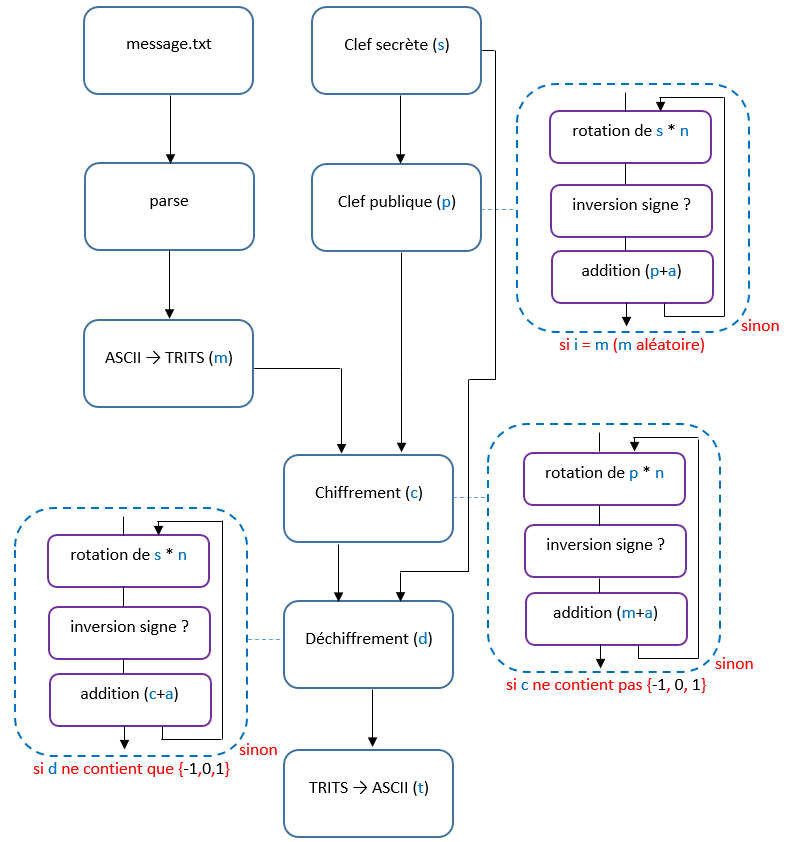
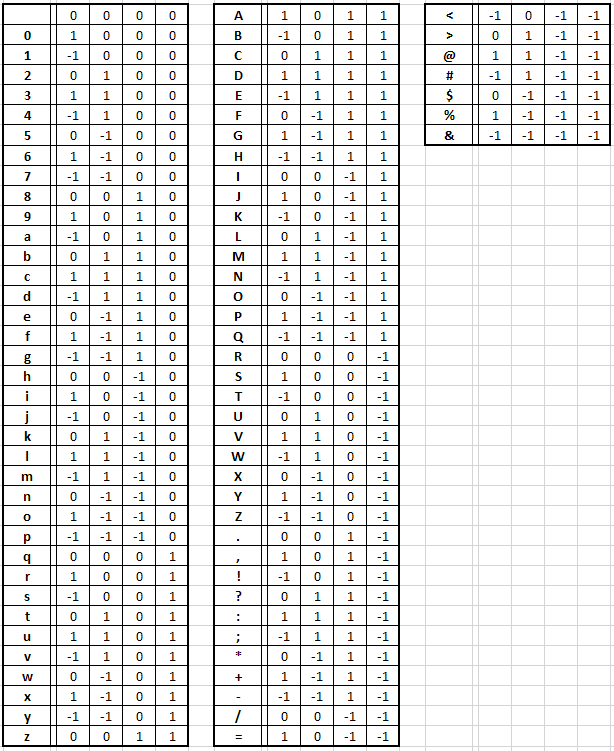
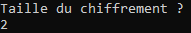
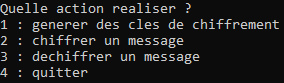
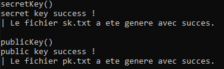
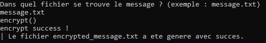
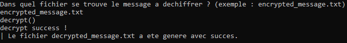
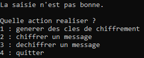

# Cryptris - algorithme simplifié

Cryptris est un logiciel d'apprentissage de la cryptographie asymétrique basé sur une simplification de la cryptographie sur les réseaux euclidiens.

[Présentation de Cryptris](https://images.math.cnrs.fr/Cryptris-1-2-Comprendre-une-des-techniques-les-plus-sophistiquees-de.html) 

[Présentation de la cryptographie sur les réseaux euclidiens](https://images.math.cnrs.fr/Cryptris-2-2-Les-dessous-geometriques-de-Cryptris-la-cryptographie-sur-les.html)

# Adaptation en C++

Je vous propose une adaptation en C++ de l'algorithme de chiffrement asymétrique utilisé par Cryptris.

## Schéma 

Pour réaliser cela j'ai commencé par analyser le fonctionnement de Cryptris et j'ai transposé cela sur un schéma.

Chaque élément du schéma représente une fonction codée en C++.

## Transcription ASCII-TRITS

Il a aussi fallu que je crée une table de transcription des symboles ASCII en TRITS (-1, 0 ou 1).

J'ai décidé d'inclure l'espace, les nombres, les lettres en minuscules et majuscules ainsi que quelques symboles utiles comme les accentuations.
Chaque symbole ASCII est transcoder avec 4 trits.

# Exécution de l'algorithme

A l'éxecution, l'algorithme demande le nombre de caractères ASCII à transcoder à la fois. 

Par défaut, si la saisie n'est pas bonne, la valeur sera de 2.

Ensuite, Nous avons plusieurs actions possible.

1. Générer un lot de clés de chiffrement (une clé secrète et une clé publique).
2.  Chiffrer un message à partir d'un fichier txt.
3.  Déchiffrer un message à partir d'un fichier txt.
4.  Quitter l'algorithme

## Générer des clés

Si le 1er choix est saisie, une clé secrète et une clé publique seront générées et plassées dans le dossier "files" de l'algorithme.

## Chiffrer un message

Si le 2e choix est saisie, l'algorithme demandera à saisir le nom du fichier texte contenant le message à chiffrer.

Une fois le nom saisie, l'algorithme chiffrera le message gràce à la clé publique (pk.txt) présente dans le dossier "files".

## Déchiffrer un message

Si le 3e choix est saisie, l'algorithme demandera à saisir le nom du hichier texte contenant le message chiffré à déchiffrer.

Une fois le nom saisie, l'algorithme déchiffrera le message gràce à la clé secrète (sk.txt) présente dans le dossier "files".

## Quitter le programme

Si le 4e choix et saisie, l'algorithme terminera son execution.

## Autre

Si la saisie ne contient aucun des choix qui sont proposés alors l'algorithme reproposera de faire un choix d'action.

